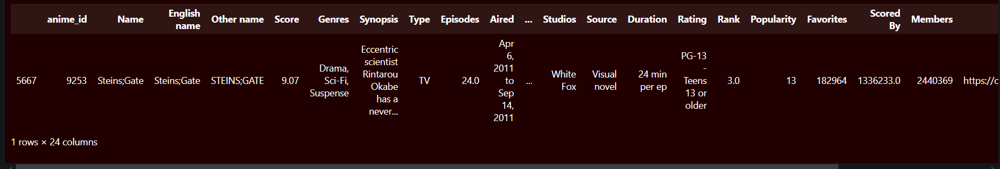
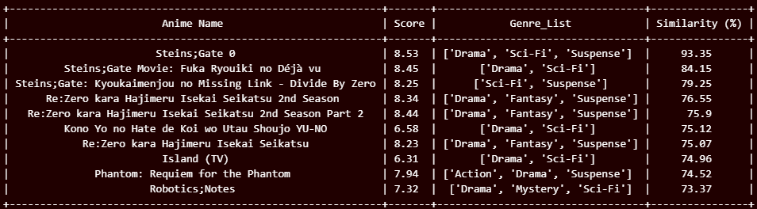
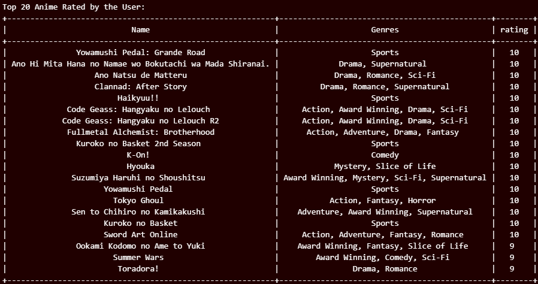

# Machine Learning Project Report - Naufal Hadi Darmawan ([GitHub](https://github.com/NaufalHD12))
# Anime Recommendation System

## Project Domain
### Background Problem
Anime has gained immense global popularity in recent years, with thousands of titles across various genres, formats, and demographics. However, due to the sheer volume of content, users often find it challenging to discover new anime that aligns with their preferences. Traditional methods like manual searches or general recommendations often fail to capture individual tastes, leading to a suboptimal viewing experience.
### Why and How Should This Problem be Solved?
A personalized recommendation system can bridge the gap by leveraging user preferences and anime attributes to provide tailored suggestions. By analyzing historical user data and anime metadata, such a system can enhance user satisfaction and engagement. Machine learning techniques, particularly content-based and collaborative filtering algorithms, can be employed to develop a robust recommendation system.
### Research Findings
Studies have demonstrated the effectiveness of recommendation systems in improving user satisfaction and interaction in entertainment platforms. Popular approaches include collaborative filtering, which leverages user interaction data, and content-based filtering, which relies on the attributes of items.  
Link: 
- https://iopscience.iop.org/article/10.1088/1742-6596/1566/1/012057
- https://www.ijfmr.com/papers/2023/2/2372.pdf

## Business Understanding
### Problem Statements
- How can we help users discover anime that matches their preferences more effectively?
- How can we leverage anime metadata and user behavior data to create accurate recommendations?
### Goals
- Develop a content-based recommendation algorithm that analyzes anime attributes to suggest similar titles. The algorithm aims to achieve a precision of at least 90% precision, ensuring relevant and satisfying recommendations based on anime content.
- Build a collaborative filtering algorithm that utilizes user ratings and preferences to recommend anime. The algorithm targets a mean absolute error (MAE) below 0.8, guaranteeing personalized and accurate recommendations for users while minimizing prediction errors in user satisfaction.
### Solution Statements
- Content-Based Algorithm  
Leverages anime metadata such as genres, studios, scores, etc to recommend titles similar to those a user has enjoyed.
- Collaborative Filtering Algorithm  
Uses user interaction data, such as ratings, to identify patterns and recommend titles based on the preferences of similar users.

## Data Understanding
### Dataset Overview
Link to Dataset: https://www.kaggle.com/datasets/dbdmobile/myanimelist-dataset
#### Anime Metadata Dataset
The dataset offers valuable information for analyzing and comprehending the characteristics, ratings, popularity, and viewership of various anime shows.  
- anime_id: Unique ID for each anime.
- Name: The name of the anime in its original language.
- English name: The English name of the anime.
- Other name: Native name or title of the anime(can be in Japanese, Chinese or Korean).
- Score: The score or rating given to the anime.
- Genres: The genres of the anime, separated by commas.
- Synopsis: A brief description or summary of the anime's plot.
- Type: The type of the anime (e.g., TV series, movie, OVA, etc.).
- Episodes: The number of episodes in the anime.
- Aired: The dates when the anime was aired.
- Premiered: The season and year when the anime premiered.
- Status: The status of the anime (e.g., Finished Airing, Currently Airing, etc.).
- Producers: The production companies or producers of the anime.
- Licensors: The licensors of the anime (e.g., streaming platforms).
- Studios: The animation studios that worked on the anime.
- Source: The source material of the anime (e.g., manga, light novel, original).
- Duration: The duration of each episode.
- Rating: The age rating of the anime.
- Rank: The rank of the anime based on popularity or other criteria.
- Popularity: The popularity rank of the anime.
- Favorites: The number of times the anime was marked as a favorite by users.
- Scored By: The number of users who scored the anime.
- Members: The number of members who have added the anime to their list on the platform.
- Image URL: The URL of the anime's image or poster.

- **Number of Rows**: 24905 
- **Number of Columns**: 24
#### User Ratings Dataset
The User Score Dataset enables various analyses and insights into user interactions with anime. By examining user ratings for different anime titles, you can identify highly-rated and popular anime among users. Additionally, you can explore user preferences and watch patterns for specific anime titles. This dataset also forms the foundation for building recommendation systems based on user ratings, helping to suggest anime that align with individual tastes.  
- user_id: Unique ID for each user.
- Username: The username of the user.
- anime_id: Unique ID for each anime.
- Anime Title: The title of the anime.
- rating: The rating given by the user to the anime.

- **Number of Rows**: 24325191
- **Number of Columns**: 5
### Data Condition
The dataset is relatively clean, with the exception of a few data quality issues. The 'Score' column, which should be numeric, contained non-numeric values like 'unknown'. These values were replaced with 0 and the column was converted to numeric. The 'Genres' column, originally a single string of genres, was transformed into a list of genres for more efficient analysis.
### Exploratory Data Analysis
This section presents a comprehensive Exploratory Data Analysis (EDA) to gain valuable insights into the dataset. The analysis follows these steps:
- Data Loading  
The dataset is loaded into a Pandas DataFrame, ensuring accessibility for analysis.
- Drop Features that are Less Relevant
- Perform initial inspection to obtain general information using **info()** and descriptive statistics using **describe()** on the dataset.
- Data Cleaning  
37% of the Score rows (9,213) are missing. Dropping these rows may significantly reduce the dataset size, potentially impacting the robustness of the analysis or model. Therefore, missing scores are filled with **0** instead of being dropped.
- Univariate Analysis  
Focuses on analyzing one variable at a time.  
    - **anime_filtered**:
        - Score Distribution  
           
         The distribution of anime scores is skewed to the right, with a peak around 6-7. This indicates that a significant portion of anime titles receive relatively high ratings. The presence of a long tail towards lower scores suggests a substantial number of anime with lower ratings or those that are unrated (represented by a score of 0). Overall, the distribution suggests a diverse range of anime quality preferences among viewers.
        - Anime Types Distribution  
          
        The bar chart above illustrates the distribution of anime types within the dataset. TV series are the most prevalent type, followed by movies and OVAs. ONA, music videos, specials, and unknown types constitute a smaller proportion of the dataset. This visualization provides a clear overview of the different anime formats present and their relative frequencies.
        - Genre Frequency  
          
        The bar chart presents the frequency distribution of various anime genres. Comedy is the most prevalent genre, followed by Fantasy and UNKNOWN. Genres like Action, Adventure, and Sci-Fi also have a significant presence. On the other hand, genres like Erotica, Gourmet, and Girls Love are less common. This visualization provides insights into the popularity and diversity of anime genres within the dataset.
    - **user_rating_filtered**:
        - Rating Distribution  
          
        The histogram displays the distribution of user ratings for anime. The majority of ratings cluster around 7-8, indicating that a significant number of users tend to give higher ratings. There is a gradual decrease in frequency as the ratings move towards lower scores, with fewer users giving ratings below 5. This suggests that users generally have positive opinions about anime and are more likely to rate them positively.
- Multivariate Analysis  
Examines relationships between variables. For this dataset, interactions between variables like ratings, popularity, and scores are analyzed.
    - Correlation Analysis to see the relationships between numeric features (Score, Popularity, and rating).  
      
    The correlation matrix reveals insights into the relationships between the variables 'Score', 'Popularity', and 'Rating'. A strong negative correlation exists between 'Score' and 'Popularity', suggesting that as popularity increases, the average score tends to decrease. Conversely, a moderate positive correlation is observed between 'Score' and 'Rating', indicating that higher ratings are associated with higher scores. The correlation between 'Popularity' and 'Rating' is weak and negative, suggesting a minimal relationship between these two variables.
    - Popularity vs. Score  
      
    The scatter plot illustrates the relationship between popularity and score. There is a clear negative trend, indicating that as popularity increases, the average score tends to decrease. This suggests that highly popular anime often receive lower average scores compared to less popular ones. However, there is also a significant amount of scatter, indicating that popularity is not the sole determinant of an anime's score.
    - Rating vs. Anime Type  
      
    The bar chart presents the average rating for each anime type. Movies have the highest average rating, followed closely by TV series. While types like UNKNOWN and Music have lower average ratings, it is important to note that even the lowest average rating is still relatively good, around 7. This suggests that anime across all types generally maintain a positive reception, with movies and TV series being perceived as slightly higher in quality compared to other formats.
    - Studios by Average Rating  
      
    The studios are ranked based on their average rating, with Robot Communications and Imagica Imageworks having the highest average rating, followed by UCOS, PERIMETRON, and Mimoid. The list includes a variety of animation and entertainment studios, with some well-known names like Studio Ghibli, TOEI Animation, Pierrot, Madhouse, Wit Studio, CloverWorks, etc. The data provides a clear visual representation of the relative performance of these studios according to their average ratings.

## Data Preparation
### Preparation for Content-Based Filtering
#### Text Vectorization (for 'Synopsis')
Text vectorization is crucial for transforming textual data into numerical representations that machine learning models can understand. Applying TF-IDF vectorization converts textual synopses into a matrix of TF-IDF scores, capturing the importance of each word within the context of the entire dataset. This representation allows for effective analysis and comparison of anime synopses, enabling tasks like clustering, classification, or recommendation systems. Additionally, limiting the number of features to 500 helps reduce dimensionality and computational complexity while still capturing the most relevant information.
#### Categorical Encoding (for 'Type', 'Studios', 'Source', 'Genre_List')
Categorical encoding is essential for transforming categorical variables into numerical representations that machine learning models can process. One-hot encoding serves as a popular technique for handling nominal categorical variables like 'Type', 'Studios', and 'Source'. This method creates binary features for each category, allowing the model to understand the significance of each category. For the 'Genre_List' column, binary features are created for each genre, indicating its presence or absence in each anime. Converting these categorical variables into numerical features enables the model to capture underlying patterns and relationships within the data, facilitating more accurate predictions.
#### Numerical Normalization (for 'Score' and 'Popularity')
Numerical normalization is crucial for ensuring that features with different scales contribute equally to the model's learning process. Standard scaling, a common technique, transforms numerical features to have zero mean and unit variance. Standardizing the 'Score' and 'Popularity' features ensures they are on the same scale, preventing features with larger magnitudes from dominating the model's decisions. This normalization step improves the model's ability to learn complex patterns and relationships within the data, leading to more accurate predictions.
#### Combine All Features
Combining all features—text (synopsis TF-IDF), categorical (encoded categories), genre, and numerical features—into a single feature matrix is essential for enabling the recommendation model to leverage all available information about the anime. Each feature type captures different aspects: text features provide context from the synopsis, categorical and genre features encode descriptive metadata, and numerical features (like scores) add quantitative insights. By integrating these diverse feature sets, the model can analyze a richer, more holistic representation of the data, leading to more accurate and meaningful recommendations. Converting to a dense array ensures compatibility with algorithms that require dense input formats.
### Preparation for Collaborative Filtering
#### Encode user_id and anime_id
Encoding user IDs and anime IDs is essential for collaborative filtering models to effectively capture user-item interactions. Assigning unique integer indices to each user and anime creates a numerical representation that the model can process. This encoding enables the model to learn latent factors and preferences associated with specific users and items.
#### Normalize Ratings
Normalizing the rating data is an important step when using collaborative filtering techniques for recommender systems. Dividing the ratings by 10 to scale them between 0 and 1 effectively accounts for differences in how individual users rate items. Some users may be more generous with high ratings, while others may be more conservative. Normalizing the ratings helps to remove this user-specific bias, allowing the collaborative filtering algorithm to better identify similarities between users and make more accurate predictions.

This is crucial because collaborative filtering relies on finding patterns in how users rate items relative to each other, rather than just the raw rating values.
#### Split the data
Splitting the data into training, validation, and test sets is crucial for building robust and reliable collaborative filtering models. The training set is used to train the model, the validation set is used to tune hyperparameters and prevent overfitting, and the test set is used to evaluate the final model's performance on unseen data. By splitting the data in this way, the model can avoid bias towards the training data and generalize well to new, unseen data. The specific split ratios (80%, 10%, 10%) are common and provide a good balance between training, validation, and testing.
#### Convert to TensorFlow datasets
Converting the data into TensorFlow datasets provides a flexible and efficient way to handle data inputs for training, validation, and testing of machine learning models, particularly for deep learning. Creating TensorFlow datasets allows for easy data shuffling to introduce randomness and prevent overfitting, batching to optimize memory usage and processing speed during training, and prefetching to keep the model pipeline filled and maximize GPU utilization.

These features make the training process more efficient and robust, as the model can learn from the data in small, manageable batches without having to load the entire dataset into memory at once. This is particularly important for large or high-dimensional datasets, where memory constraints can become a bottleneck. By leveraging the flexibility and performance optimizations offered by TensorFlow datasets, machine learning workflows can be streamlined and the overall effectiveness of models can be improved.

## Modeling & Results
### Content-Based Filtering
Content-based recommendation systems use the features of the items (in this case, anime) to suggest similar items to users. The similarity is computed based on various attributes such as genres, synopsis (text features), categories (e.g., type, source), and numerical features like scores and popularity.

**How it works:**
- Similarity Computation: **Cosine similarity** is calculated between all anime vectors in the final_features matrix. This measures the angle between vectors, where a smaller angle indicates higher similarity.
- Recommendation Generation: For a given anime (input query), the algorithm retrieves other anime with the highest similarity scores, recommending them to the user.

**Advantages of Content-Based Recommendation Systems**
- The system can recommend items specific to a user's preferences based solely on the item they like.
- Since the system relies on item attributes, it can recommend items even without historical user interaction data.
- Recommendations are explainable because they are based on specific item attributes (e.g., "similar genre" or "similar synopsis").

**Disadvantages of Content-Based Recommendation Systems**
- New items with insufficient or no attributes/features may not be well-represented in recommendations.
- Recommendations can become too narrow, suggesting only items very similar to the ones the user already likes (known as the "serendipity problem").
- The system's performance heavily relies on the quality and representation of the extracted features. Poor feature engineering can lead to suboptimal results.
#### Get 10 Recommendations
**Let's Find Out Anime that Similar to Steins;Gate**  

**Top 10 Recommendations**
  
The recommendations provided for Steins;Gate are highly relevant and well-aligned, as they include titles that share similar genres, themes, and storytelling styles. For instance, the top recommendations such as Steins;Gate 0 and Steins;Gate Movie are direct sequels or spin-offs, naturally achieving high similarity scores (93.35% and 84.15%). Other recommendations like Re:Zero kara Hajimeru Isekai Seikatsu and Phantom: Requiem for the Phantom also match the genres of Drama, Sci-Fi, and Suspense, appealing to fans of complex narratives and psychological tension. The inclusion of Robotics;Notes, which is set in the same universe as Steins;Gate, further demonstrates the accuracy of the recommendations. Overall, the list effectively captures anime with overlapping themes, high scores, and strong narrative connections, making it a solid set of suggestions for Steins;Gate fans.
### Collaborative Filtering
Collaborative filtering focuses on user-item interactions to generate recommendations. It predicts a user's preferences based on their past interactions and the interactions of similar users or items. In my implementation, I use matrix factorization with embeddings to model these interactions.

**Here's a breakdown of the algorithm:**
- User and Item Embeddings:  
Each user (user_id) and anime (anime_id) is represented as a learned embedding vector of fixed size (embedding_dim).
These embeddings capture latent features that represent preferences (for users) or characteristics (for anime).
- Embedding Combination:  
The user and anime embeddings are concatenated to form a single feature vector representing the interaction between the user and the anime.
- Feedforward Network:  
This concatenated vector is passed through dense layers with dropout regularization to predict the rating. The layers learn complex, non-linear relationships between the user and anime embeddings.
- Output Layer:  
The output layer has a single neuron that predicts a scalar value (the rating).
- Training:  
The model is trained on known user-anime ratings to minimize the error (e.g., mean squared error). Metrics like mean absolute error (MAE) and root mean squared error (RMSE) are used to evaluate performance.
- Prediction:  
For unseen user-anime pairs, the model predicts ratings based on learned embeddings and feedforward layers.

**Advantages of Collaborative Filtering**
- Personalized Recommendations:
    - It uses actual user behavior (ratings or interactions), resulting in highly personalized recommendations.
- Domain Independence:
    - Unlike content-based systems, it does not require domain-specific features (e.g., synopsis, genres). It solely relies on the interaction matrix.
- Serendipity:
    - Can recommend items a user might not have explicitly searched for but would enjoy based on similar users/items.

**Disadvantages of Collaborative Filtering**
- Cold Start Problem:
    - Struggles with new users or items due to a lack of historical interaction data.
    - This is especially challenging in sparse datasets where most users or items have limited ratings.
- Scalability:
    - Requires substantial computational resources for large datasets. In your case, with over 24 million user-anime interactions, training the model and computing predictions can be computationally expensive.
- Data Sparsity:
    - When the interaction matrix is sparse (i.e., most users rate only a few items), it may fail to capture meaningful patterns, leading to suboptimal recommendations.

#### Training Process
In the training step, the model is trained using the **fit()** method with a training dataset (train_ds) and a validation dataset (val_ds) to monitor its performance. The training runs for **10 epochs**, where the model iteratively learns from the training data and adjusts its weights to minimize the loss. A **ReduceLROnPlateau** callback is applied to dynamically adjust the learning rate: if the validation performance stagnates for 2 consecutive epochs (patience), the learning rate is reduced by a factor of 0.3. This helps the model converge more effectively by preventing it from overshooting the optimal solution, especially when learning begins to plateau. By combining these steps, the model aims to achieve improved generalization while efficiently utilizing the learning rate.
#### Get 10 Recommendations
Test the recommendations for user_id = 1291085

**User 1291085 Top 20 Anime by Rating**  

**Top 10 Recommended Anime that the User Hasn't Watched**  

In the Top 20 Anime Rated by the User section, the user's favorite anime show ratings predominantly at 10, reflecting a strong preference for highly acclaimed titles. The list includes a mix of genres like sports (Yowamushi Pedal), action (Code Geass), romance (Clannad: After Story), and fantasy (Fullmetal Alchemist: Brotherhood). This diverse collection indicates the user's broad interest across emotional, action-packed, and thought-provoking series.

The Top 10 Recommended Anime that the User Hasn't Watched section highlights recommendations generated through collaborative filtering. Titles such as "Vampire Knight" and "School Days: Magical Heart Kokoro-chan" are predicted to receive a high rating of 9.0 based on similarities in user behaviors and interactions. These recommendations span genres like romance, comedy, supernatural, and action, showcasing the system's ability to align new suggestions with the user's existing tastes. This approach effectively enhances user engagement by discovering unseen anime that resonates with their preferences.

## Evaluation
### Content-Based Filtering
#### Evaluating Use Precision Metric
**Precision = (Number of Relevant Recommendations) / (Total Number of Recommendations)**  
- Content-based filtering focuses on recommending items based on item features (e.g., genres, scores, etc). Precision ensures you are evaluating how effectively the system filters and recommends only relevant items.
- Precision avoids penalizing models for not making enough recommendations, unlike recall.

A precision of 100% indicates that the recommendation algorithm performs well because all of the recommendations are considered relevant.

### Collaborative Filtering
#### Metrics that I used:
- **Loss (Mean Squared Error - MSE):**
    - Definition: The Mean Squared Error (MSE) is a measure of the average squared difference between the predicted ratings and the true ratings.
    - Formula: MSE = **Σ(y_true - y_pred)^2 / n**, where y_true are the true ratings, y_pred are the predicted ratings, and n is the number of samples.
    - In the case of collaborative filtering, the ratings are usually on a numerical scale (e.g., 1-5 stars, 1-10 scores). This means that the model needs to predict a continuous rating value, that's why I pick MSE as the loss function.

      
    - The training loss and validation loss both decrease over the epochs, indicating that the model is learning effectively and generalizing well to the validation data.
    - The training loss and validation loss are close to each other, suggesting that the model is not overfitting to the training data.

- **Mean Absolute Error (MAE):**
   -  Definition: The Mean Absolute Error (MAE) is a measure of the average absolute difference between the predicted ratings and the true ratings.
    - Formula: MAE = **Σ|y_true - y_pred| / n**, where y_true are the true ratings, y_pred are the predicted ratings, and n is the number of samples.
    - MAE is more interpretable than MSE, as it represents the average rating prediction error. It's a useful metric for collaborative filtering as it directly relates to the quality of recommendations.
    
      
    - The training Mean Absolute Error (MAE) and validation MAE both decrease over the epochs.
    - The training MAE and validation MAE are also close to each other, further indicating that the model is not overfitting.

- **Root Mean Squared Error (RMSE):**
    - Definition: The Root Mean Squared Error (RMSE) is the square root of the Mean Squared Error (MSE).
    - Formula: RMSE = **√(Σ(y_true - y_pred)^2 / n)**, where y_true are the true ratings, y_pred are the predicted ratings, and n is the number of samples.
    - RMSE puts more emphasis on larger errors compared to MAE, making it more sensitive to outliers. It provides an interpretable scale (same as the rating scale) for understanding the model's predictive accuracy.

      
    - The training RMSE and validation RMSE (orange line) both decrease over the epochs.
    - The training RMSE and validation RMSE are close to each other, confirming the model's good generalization performance.

#### Evaluate on test dataset
- **Test Loss: 0.0161**
    - The test loss represents the model's performance on the unseen test data.
    - A low test loss, such as 0.0164, indicates that the model is making accurate predictions on the test set.

- **Test Mean Absolute Error (MAE): 0.0945**
    - The MAE measures the average absolute difference between the predicted and actual ratings.
    - A low MAE, like 0.0946, suggests that the model's predictions are close to the true ratings on average.

- **Test Root Mean Squared Error (RMSE): 0.1254**
    - RMSE is the square root of the mean squared error (MSE), which measures the average squared difference between predicted and actual ratings.
    - RMSE gives a higher penalty to larger errors compared to MAE, making it more sensitive to outliers.
    - A low RMSE, such as 0.1265, indicates that the model is making accurate predictions with relatively small errors.

## Closing
In conclusion, this project has demonstrated the effectiveness of leveraging both content-based and collaborative filtering techniques to build a robust anime recommendation system. The comprehensive Exploratory Data Analysis (EDA) provided valuable insights into the dataset, helping to identify the most relevant features and inform the subsequent modeling approaches.

The content-based filtering algorithm, which analyzes anime metadata such as genres, synopses, and scores, was able to accurately recommend similar titles to a user's preferences. The collaborative filtering model, which learns from user-item interactions, also proved effective in generating personalized recommendations tailored to individual user tastes.

Through the use of various evaluation metrics, including precision, mean squared error (MSE), mean absolute error (MAE), and root mean squared error (RMSE), the models were thoroughly assessed to ensure their reliability and accuracy. The results indicate that the developed recommendation system can provide users with high-quality anime suggestions, enhancing their discovery and enjoyment of the vast anime landscape.

By continuously refining and enhancing the anime recommendation system, we can empower users to navigate the ever-growing anime industry with greater ease and satisfaction.
